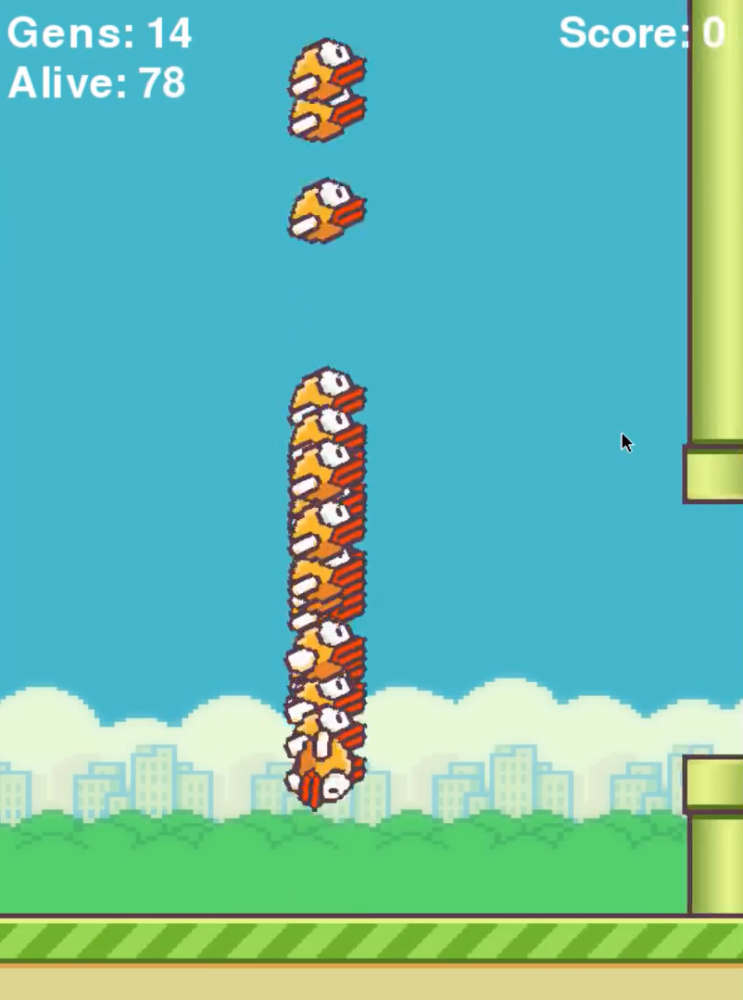
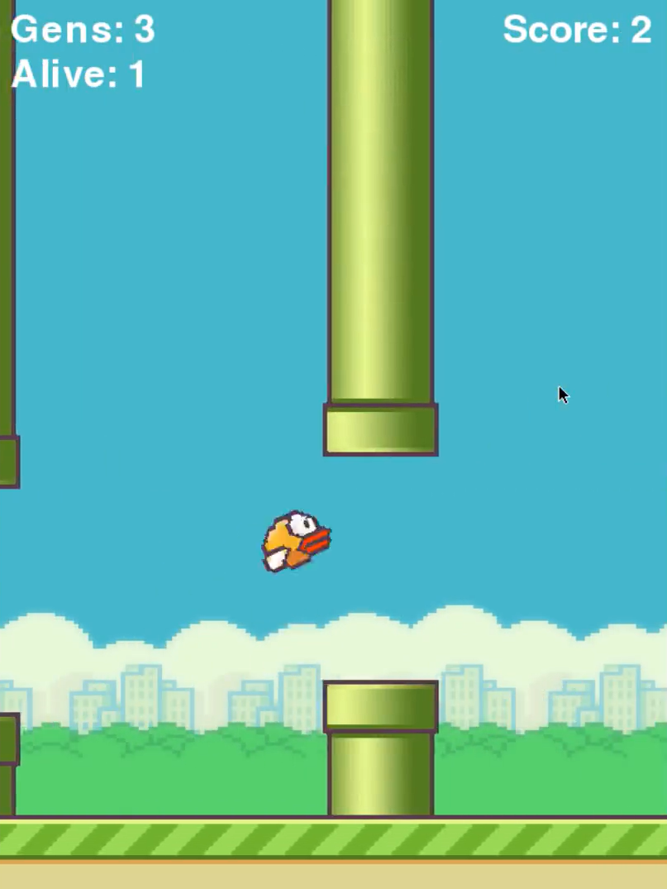

# 🎮 Flappy Bird NEAT AI

<p align="center">
  
  
  
</p>

Welcome to a colorful Flappy Bird clone where an AI learns to fly using NEAT (NeuroEvolution of Augmenting Topologies) — watch neural networks evolve to master the game!

---

## ✨ Features
- 🧠 **AI-powered gameplay** using NEAT to evolve bird behavior
- 🌈 **Smooth animations** and polished visuals
- 📈 **Score tracking** and fitness evaluation
- 🧩 **Modular design**: Bird, Pipe, Base, and Game loop

---

## 🚀 Getting Started

### 1) Requirements
- **Python** 3.8+
- **Dependencies**:
  - `pygame`
  - `neat-python`

### 2) Install
```bash
pip install pygame neat-python
```

### 3) Run
```bash
python flappy.py
```
- The NEAT config is loaded from `config-feedforward.txt` (already included).
- A window will open and the AI will start learning over generations.

---

## 🕹️ How It Works (Quick Overview)
- Each bird is controlled by a small neural network.
- Inputs include the bird's `y` position and distances to the next pipe openings.
- Networks are evolved with NEAT over generations to maximize survival and score.

---

## 📸 Screenshots

<p align="center">
  
  
</p>

---

## 📁 Project Structure
```
.
├── flappy.py                 # Main game + NEAT training loop
├── config-feedforward.txt    # NEAT configuration
├── imgs/                     # Game assets (bird, pipes, background)
└── screenshots/              # Project screenshots
```

---

## 🧪 Tuning Tips
- Adjust **pipe gap** in `Pipe.GAP` for difficulty.
- Modify **bird physics** in `Bird.move()` for different behavior.
- Evolve more generations by changing `p.run(main, 50)` in `flappy.py`.

---

## 🙌 Acknowledgments
- Built with ❤️ using **Pygame** and **NEAT-Python**.

---

## 📄 License
This project is for learning and experimentation. Add a license if you plan to share/distribute.